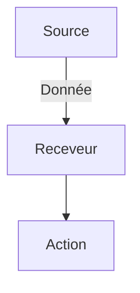

# RXJS / Observables

### Un Observable, qu’est-ce que c’est. C’est d’abord un objet.

La meilleure façon d’apprendre, c’est par la pratique, sur des cas concrets. Supposons que nous avons une application qui montre en temps réel les évolutions du cours d’une cryptomonnaie. Lorsque le cours atteint une certaine valeur, on souhaite envoyer une notification à l’utilisateur.

On peut récupérer ces valeurs à l’aide d’une websocket :

```jsx
const socket = new WebSocket('wss://api.crypto.com/tutocoin');
```

Cet objet va recevoir la nouvelle valeur de notre **tutocoin** dès que celle-ci change.

Ok, mais comment l’interface utilisateur de mon application Angular saura que les valeurs ont été mises à jour ? Moi, j’aimerais pouvoir m’abonner à cet objet Websocket et recevoir les updates comme une newsletter.

C’est là qu’entrent en jeu les Observables et ce qu’on appelle la Programmation Réactive. Comme son nom l’indique, il s’agit d’un [paradigme](https://ryax.tech/fr/la-programmation-reactive-cest-quoi/) qui repose sur l’écoute et la réaction à des sources émettrices de données.

En gros :



L’observable va se trouver entre la source et le receveur. Il s’agit tout simplement **d’une liste de données qui se constitue dans le temps.**

Un observable, comme son nom l’indique, c’est un objet qu’on peut… observer.

Un peu comme une sentinelle qui regarde au loin et qui prévient les membres de l’équipage de ce qu’elle voit poindre à l’horizon.


Notre Observable peut faire plusieurs choses et c’est ce que nous allons voir maintenant.

### Que peut faire un observable ?

* **Prévenir l’équipage des navires qui arrivent…** C’est à dire donner l’info sur la dernière donnée arrivée, ou si on reprend notre cas, donner la dernière valeur de la tutocoin. C’est la fonction qu’on appelle **next()** . Elle renvoie la prochaine valeur de la source. Dans notre cas, inspiré de [ce tutoriel](https://angulardive.com/blog/how-to-use-angular-observables-to-stream-real-time-data-in-your-applications/)on aura :
* **Prévenir l’utilisateur qu’il y a un bug au moment de la récupération de la dernière valeur du cours de tutocoin**… Dans ce cas, on ne peut pas laisser l’utilisateur en plan. Il faut le prévenir. On utilisera la fonction **error()**.
* **Arrêter d’observer les navires et prendre sa pause.**\* Ce sera la fonction **complete()**. Elle n’est pas la plus fréquente.

Ok, super, maintenant, comment je vais imbriquer tout ça pour créer mon Observable ? Je vais reprendre les infos du tutorial de [Angulardive](https://angulardive.com).

Création de l’observable… Qui est un objet donc on utilise l’opérateur \*\*[new\*\*](https://developer.mozilla.org/fr/docs/Web/JavaScript/Reference/Operators/new) qui crée une nouvelle instance d’un objet à partir de son constructeur.

```jsx
const tutoCoinObservable = new Observable(observer => {
		
		// Ici on se connecte à notre API
		const socket = new WebSocket('wss://api.crypto.com/tutocoin');

		// Ici on va utiliser next() pour gérer l'arrivée de nouvelles données. 
		// C'est l'objet WebSocket qui permet de récupérer les dernières infos ici.
		socket.onmessage = event => {
	    const tutoCoinValue = JSON.parse(event.data);
	    observer.next(tutoCoinValue );
  };
}
```
